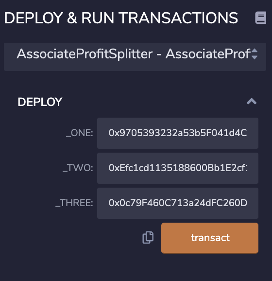

SOLIDITY HOMEWORK - Profit Splitter:

This repository contains the a smrt contract which can be used to evenly distribute deposits (ETH) to three different addresses simultaneously.

Simply deploy the contract (specifying the three addresses)

no slash

Call the Deposit function (specifying an amount)

The funds will be automatically divided and split evenly between the 3 addresses.

before:

screenshots/Screen Shot 2021-07-15 at 2.58.18 PM.png

send the transaction:

screenshots/Screen Shot 2021-07-15 at 3.00.24 PM.png

Approve the transaction:

screenshots/Screen Shot 2021-07-15 at 2.59.12 PM.png

after:

screenshots/Screen Shot 2021-07-15 at 2.59.37 PM.png

Navigate to the Remix IDE and create a new contract called AssociateProfitSplitter.sol using the starter code for Level One above.
While developing and testing your contract, use the Ganache development chain, and point MetaMask to localhost:8545, or replace the port with what you have set in your workspace.