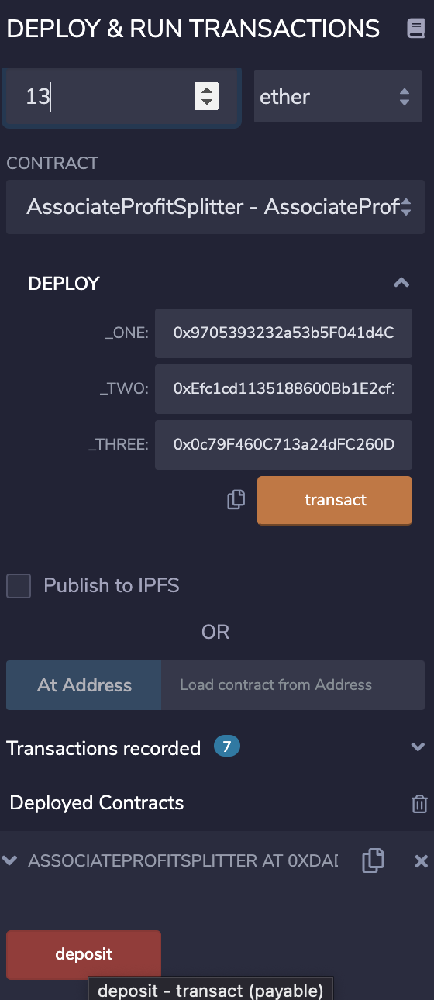

SOLIDITY HOMEWORK - Profit Splitter:

This repository contains a .sol smart contract which can be used to evenly distribute deposits (ETH) to three different addresses simultaneously.

Simply deploy the contract (specifying the three addresses)

****
Check your wallet balances:

****
Send a transaction (in this example we're sending 13 ETH):

This will call the Deposit function (specifying an amount).

****

Approve the transaction with your browser wallet:

****

The funds will be automatically divided and split evenly between the 3 addresses.

Check your balances again!

****
You can view the transaction details by pasting the transaction hash into a block explorer:

****
